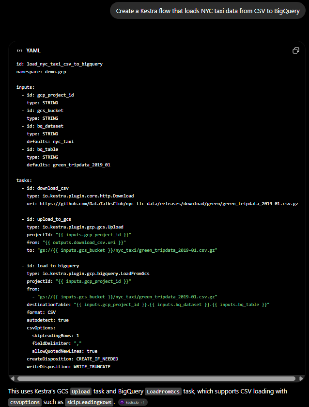
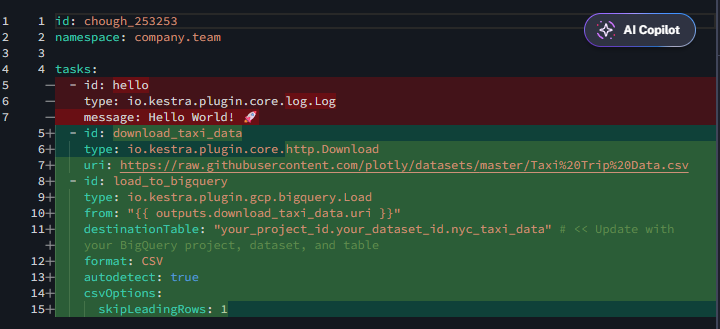
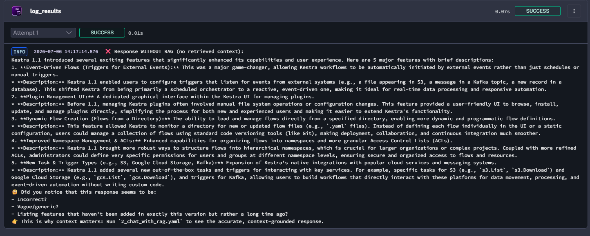
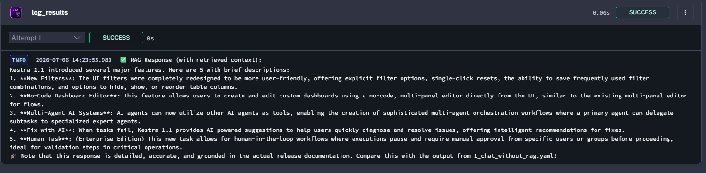
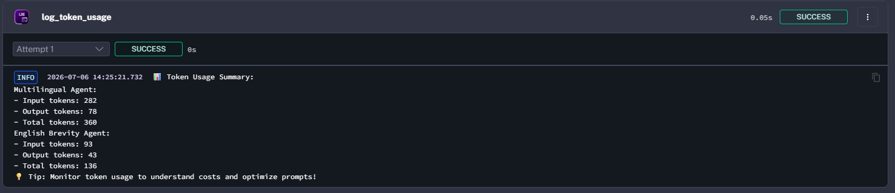
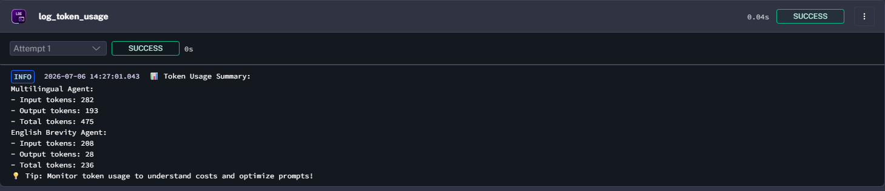
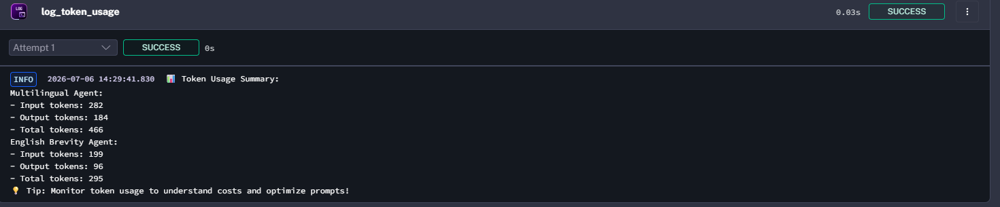
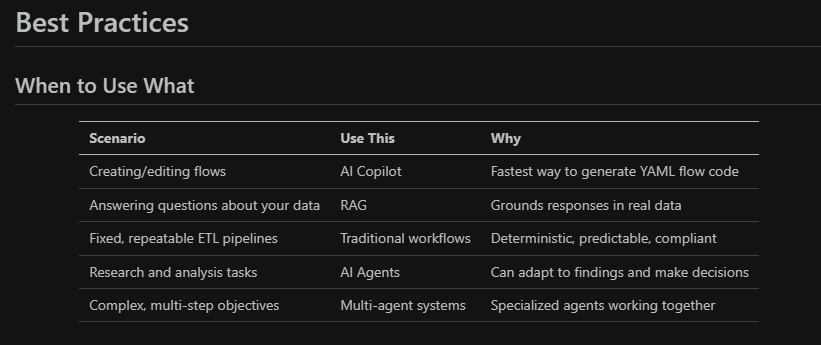

## Homework: AI Orchestration with Kestra

## Prerequisites

Before starting this homework, ensure you have:

1. Completed the [Module 3 lessons](./course-material/README.md) — the questions reference flows and concepts covered there

2. Kestra running locally with API keys configured (see the [Setup](./course-material/lessons/03-setup.md) lesson) -- this includes the Gemini API key, which is also required for the AI Copilot (don't forget the base 64 trick for the API keys)

I created a .env file containing the normal API_KEYS (added _BASE at the end to differ from the one we build for Kestra) (with dirdotenv, they're loaded automaticaly so no hard coding in the terminal)

To install dirdotenv (once for all in uv) (super usefull tool that automaticaly loads / unloads your .env secrets when you navigate through your folders)
```bash
 uv tool install dirdotenv
 echo 'eval "$(dirdotenv hook bash)"' >> ~/.bashrc
 source ~/.bashrc # or relaunch a terminal
```
To export your keys for Kestra
```bash
export GEMINI_API_KEY=$(echo $GEMINI_API_KEY_BASE) # required
export SECRET_GEMINI_API_KEY=$(echo -n $GEMINI_API_KEY | base64) # required
export SECRET_OPENAI_API_KEY=$(echo -n $SECRET_OPENAI_API_KEY_BASE | base64)   # required for flow 3
export SECRET_TAVILY_API_KEY=$(echo -n $SECRET_TAVILY_API_KEY_BASE | base64)   # optional
```
Launch Kestra in docker (launch docker desktop first if you're in WSL)
```bash
cd course-material
docker compose up -d
# docker compose down # when homework done
```


3. Imported all flows from the `course-material/flows/` directory (covered in the Setup lesson)

```bash
cd course-material

# Adjust username and password to match your Kestra setup
curl -X POST -u 'admin@kestra.io:Admin1234!' http://localhost:8080/api/v1/flows/import -F fileUpload=@flows/1_chat_without_rag.yaml
curl -X POST -u 'admin@kestra.io:Admin1234!' http://localhost:8080/api/v1/flows/import -F fileUpload=@flows/2_chat_with_rag.yaml
curl -X POST -u 'admin@kestra.io:Admin1234!' http://localhost:8080/api/v1/flows/import -F fileUpload=@flows/3_rag_with_websearch.yaml
curl -X POST -u 'admin@kestra.io:Admin1234!' http://localhost:8080/api/v1/flows/import -F fileUpload=@flows/4_simple_agent.yaml
curl -X POST -u 'admin@kestra.io:Admin1234!' http://localhost:8080/api/v1/flows/import -F fileUpload=@flows/5_web_research_agent.yaml
curl -X POST -u 'admin@kestra.io:Admin1234!' http://localhost:8080/api/v1/flows/import -F fileUpload=@flows/6_multi_agent_research.yaml
```


## Question 1: Context Engineering

Try the following experiment:

1. Open ChatGPT in a private browser window: https://chatgpt.com
2. Enter this prompt: "Create a Kestra flow that loads NYC taxi data from CSV to BigQuery"

3. Then, use Kestra's AI Copilot with the same prompt



After trying the same prompt in ChatGPT vs Kestra's AI Copilot, what is the primary reason AI Copilot generates better Kestra flows?

- AI Copilot uses a more powerful model
- X AI Copilot has access to current Kestra plugin documentation
- AI Copilot uses more tokens
- AI Copilot has internet access

## Question 2: RAG vs No RAG

Run both `1_chat_without_rag.yaml` and `2_chat_with_rag.yaml` in the Kestra UI. Read the execution logs for each.




The non-RAG response about Kestra 1.1 features is best described as:

- Accurate and specific, matching the actual release notes
- X Vague, generic, or fabricated — the model guesses from training data
- Empty — the model refuses to answer without context
- Identical to the RAG version

## Question 3: Token usage — short summary

Run `4_simple_agent.yaml` with `summary_length = short` (leave the other inputs as defaults).

Open the execution logs and find the token usage logged by the `log_token_usage` task.



What is the approximate **output** token count for `multilingual_agent`?

- 5-15 tokens
- X 60-100 tokens (78)
- 200-400 tokens
- 500+ tokens

## Question 4: Token usage — long summary

Run `4_simple_agent.yaml` again with `summary_length = long`.

Compare the `multilingual_agent` output token count to your result from Question 3. 


Roughly how many times more output tokens does the long summary use?

- About the same (within 20%)
- X 2-5x more (193)
- 10-20x more
- 50x more

## Question 5: Modifying a flow

Open `4_simple_agent.yaml` in the Kestra flow editor. Find the `english_brevity` task and change its prompt from asking for exactly **1 sentence** to asking for exactly **3 sentences**.

Save the flow, then run it with `summary_length = long`.



Compare the `english_brevity` output token count to the original 1-sentence version (also with `summary_length = long`). How do they compare?

- X About the same (within 20%) (184)
- 2-4x more
- 5-10x more
- 10x+ more

## Question 6: Best Practices

Based on what you learned in this module, for production workflows requiring deterministic, repeatable results with strict compliance requirements (e.g., financial reporting, workflows in highly regulated industries), which approach is most appropriate?



- Always use AI agents for maximum flexibility and adaptation
- X Use traditional task-based workflows for predictability and auditability
- Use only RAG without agents for better performance
- Use web search tools exclusively to ensure current data


## Submitting the Solutions

* Form for submitting: https://courses.datatalks.club/llm-zoomcamp-2026/homework/hw3
* Check the link above to see the due date
